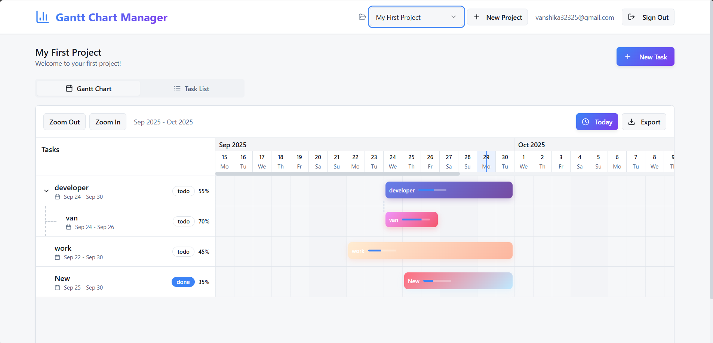

```markdown
# 📊 Gantt Chart

An interactive **Gantt Chart application** built with **React, Vite, and Supabase**.  
It helps visualize project tasks, timelines, and dependencies in an intuitive way.  
This project is useful for project management, scheduling, and tracking progress over time.

---

## 🚀 Features

- 📅 Create and manage tasks with start and end dates  
- 🔗 Define dependencies between tasks  
- 🎨 Clean and interactive UI (built with React + shadcn/ui)  
- ⚡ Fast development powered by **Vite**  
- ☁️ Backend support with **Supabase**  
- 🛠️ Modular code structure for easy customization  

---

## 🖥️ Demo



---

## 📂 Project Structure

```

gantt-tree-hub/
├── public/                  # Public assets (images, icons, static files)
│   └── image.png            # Demo screenshot
├── src/                     # Main source code
│   ├── components/          # Reusable UI and feature components
│   │   ├── Auth/            # Authentication components
│   │   ├── GanttChart/      # Gantt chart-related components
│   │   ├── TaskManager/     # Task management components
│   │   ├── ui/              # Generic UI components (buttons, inputs, etc.)
│   │   └── ProjectSelector.tsx
│   ├── hooks/               # Custom React hooks
│   ├── integrations/        # API or external service integrations
│   ├── lib/                 # Utility libraries or helpers
│   ├── pages/               # Application pages
│   ├── types/               # TypeScript type definitions
│   ├── utils/               # General utility functions
│   ├── App.tsx              # Root React component
│   ├── App.css              # Global styles for App
│   ├── index.css            # Global CSS styles
│   └── vite-env.d.ts        # Vite TypeScript environment declarations
├── supabase/                # Supabase configuration & setup
├── .env                     # Environment variables
├── index.html               # Main HTML entry point
├── components.json          # Component config (shadcn/ui, etc.)
├── package.json             # Project dependencies & scripts
├── package-lock.json        # Dependency lockfile
├── bun.lockb                # Bun package manager lockfile
├── eslint.config.js         # ESLint configuration
└── README.md                # Project documentation

````

---

## 🛠️ Installation & Usage

1. **Clone the repository**  
   ```bash
   git clone https://github.com/vanshika20006/Gantt-Chart.git
   cd Gantt-Chart
````

2. **Install dependencies**

   ```bash
   npm install
   ```

   or if using bun:

   ```bash
   bun install
   ```

3. **Setup environment variables**
   Create a `.env` file and configure your **Supabase keys**.

4. **Run the development server**

   ```bash
   npm run dev
   ```

5. Open in browser → `http://localhost:5173`

---

## 📸 Screenshots

👉 Example Gantt Chart view:


---

## 📖 What is a Gantt Chart?

A **Gantt Chart** is a project management tool that visually represents tasks over time.
Each task is shown as a horizontal bar with:

* **Start and end dates**
* **Duration of work**
* **Dependencies between tasks**

This helps teams plan, schedule, and track progress efficiently.

---

## 🤝 Contributing

Contributions, issues, and feature requests are welcome!
Check the [issues](https://github.com/vanshika20006/Gantt-Chart/issues) page.

---

## 🧑‍💻 Author

* **Vanshika**
  🔗 [GitHub Profile](https://github.com/vanshika20006)

---

## ⭐ Show your support

If you like this project, please give it a ⭐ on [GitHub](https://github.com/vanshika20006/Gantt-Chart)!

---

## 📜 License

This project is licensed under the **MIT License** – feel free to use, modify, and distribute it.

```


